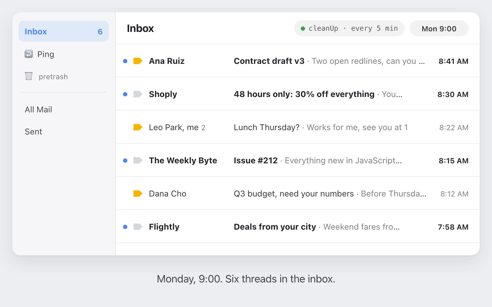
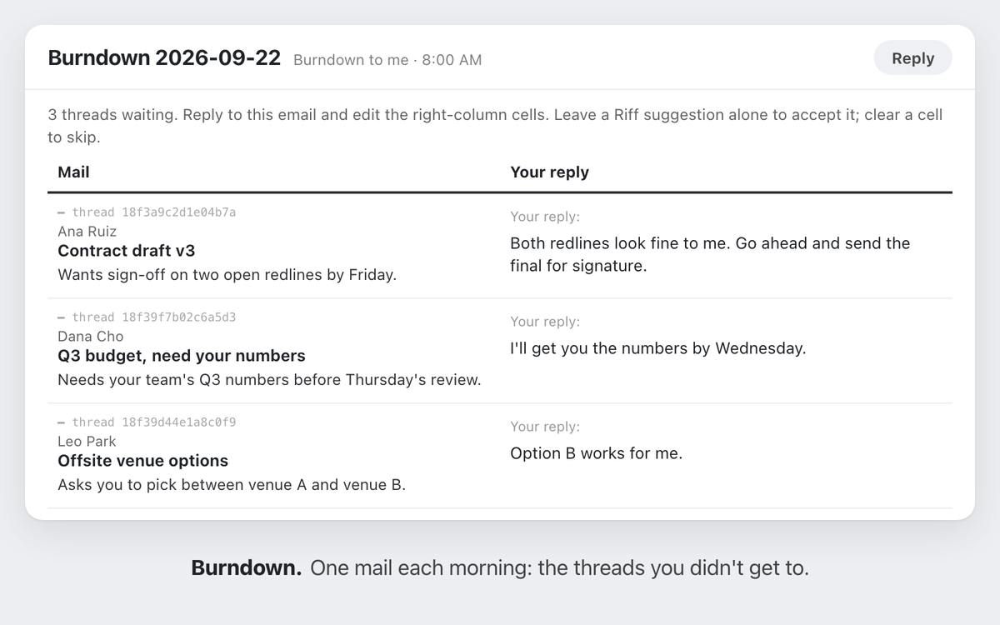

# GmailTidy

Google Apps Script for Gmail inbox zero: auto archive, auto delete old emails, follow-up reminders. Runs on its own inside your Google account.

## The five

1. **Hot: auto archive.** Inbox is important mail that's either unread or younger than a day. Read mail older than that is archived automatically. New senders land in Hot or Meh by your first call: mark important to let them in, unimportant to filter them out.
2. **Meh: auto delete old emails.** Pretrash is a browsing space for newsletters and low-priority mail. Salvage means "keep this kind." Auto deletes after 20 days if untouched.
3. **Ping: follow-up reminder.** Read mail two to four days old with no reply gets resurfaced to Hot. Remove the marker and it's archived for good. Resurfaced at most once per thread.
4. **Bunch: a label per sender.** Per domain labels for one click access to all conversations with a sender.
5. **Stash: find attachments.** Important threads carrying an attachment get a label for easy retrieval.

If this approach resonates, check out [Posta](https://sryo.github.io/Posta/), my opinionated take on a mail client.

## The way

* Gmail's importance flag is the single source of truth.
* Reversible by default: pretrash before trash.
* Heuristics over guesses: every action is triggered by a Gmail signal you can inspect.

## Scripts

**`cleanUp.gs`**. Schedules low-priority mail for deletion and keeps pinned/important state consistent.

**`public.gs`**. Publishes Gmail threads labeled `🌎 Public` as a web page. Deploy as "Execute as: me" with access "Anyone with the link" at most; never "Anyone, even anonymous."

**`riff.gs`**. Apply `🦾` to any thread to add some AI muscle. Riff uses recent sent emails labeled `🫵` to match your voice.

**`bunch.gs`**. Groups important untagged threads under per-domain labels.

**`burndown.gs`**. The threads you didn't get to yesterday, all in one mail. Reply once. Drafts land on each thread.

## Setup (one-time)

1. Add `GEMINI_API_KEY` to Script Properties ([get one](https://aistudio.google.com/app/apikey)) so Riff and the Burndown summarizer can call Gemini.
2. Run `install()` from the editor. It creates the spreadsheet, sets up the triggers, and confirms Gmail's Advanced Service is enabled.
3. Label a handful of sent emails with `🫵` so Riff has voice examples to mimic.
