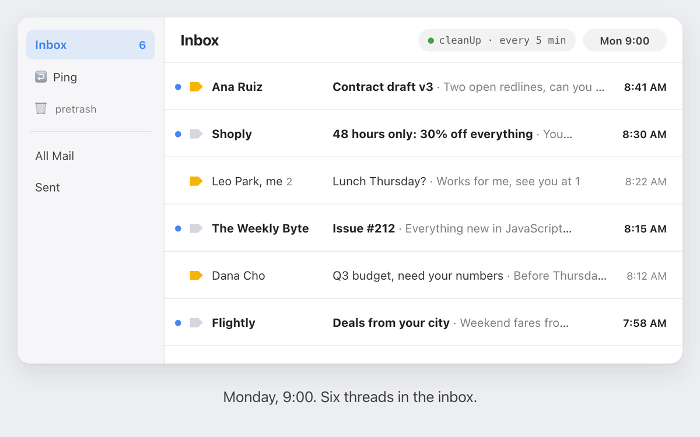
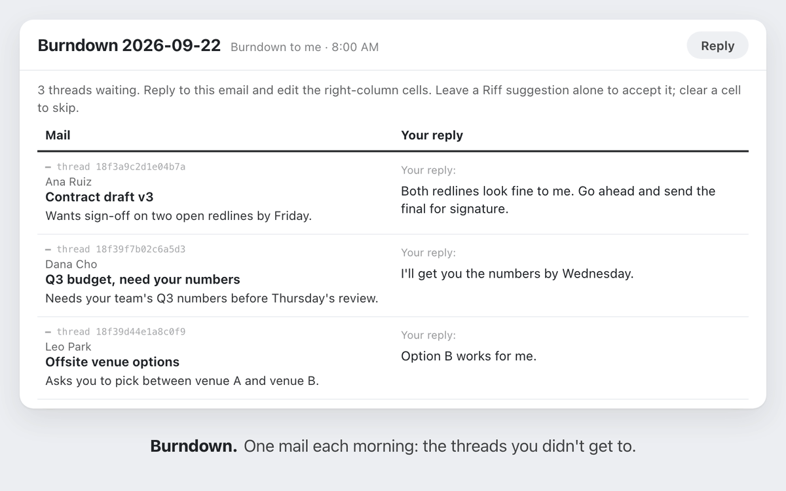

# GmailTidy

<picture>
  <source media="(prefers-color-scheme: dark)" srcset="assets/hero-dark.png">
  
</picture>

Google Apps Script for Gmail inbox zero: auto archive, auto delete old emails, follow-up reminders. Runs on its own inside your Google account.

**[Set up in 3 steps →](#setup-one-time)** · [How it works](#the-five)

## The five

1. **Hot: auto archive.** Read mail older than a day leaves the inbox, unless it's pinned, snoozed or waiting on a reply. Mark a sender important once and their mail keeps landing here.
2. **Meh: auto delete old emails.** Newsletters and low-priority mail skip the inbox and wait in 🗑️. Star, reply or mark important to keep a thread. After 20 days the rest moves to Trash.
3. **Ping: follow-up reminder.** A message you haven't answered in 2 to 4 days comes back with `↩️ Ping` and a draft reply. Remove the label to dismiss it. Once per thread.
4. **Bunch: a label per sender.** Important threads get a label for the sender's domain, so every conversation with a company sits in one place.
5. **Stash: find attachments.** Important threads with attachments get `🪎 Stash`.

## Opt-in

**Riff: draft a reply.** Label a thread `🦾 Riff` and a reply in your voice is waiting in it, ready to send. Pinged threads get one automatically. Your voice comes from sent mail labeled `🫵 Voice`.

**Burndown: one mail a day.** Unanswered mail piles up because each thread is its own chore. Burndown gathers the important ones from the past week into one mail, each with a suggested reply. Reply once to the digest and each thread gets its own draft.

**Public: share a thread.** Label a thread `🌎 Public` and anyone with the link can read it. Remove the label to unpublish.

## The way

* Gmail's importance flag is the single source of truth.
* Reversible by default: pretrash before trash.
* Every automatic action traces to a Gmail signal you can inspect.

## Setup (one-time)

1. Add `GEMINI_API_KEY` to Script Properties ([get one](https://aistudio.google.com/app/apikey)) for Riff and Burndown.
2. Run `install()`. It creates the tracking sheet, labels and triggers, and checks that Gmail's Advanced Service is on.
3. Label a handful of your sent emails `🫵 Voice` so Riff can match your voice.

Optional, for Public: Deploy → New deployment → Web app, Execute as Me, access Anyone. Open the `/exec` URL once and it's mailed to you.

Empty labels are deleted every 30 minutes, yours included. GmailTidy's own labels are kept.

Related: [Posta](https://sryo.github.io/Posta/), a mail client built on the same ideas.
